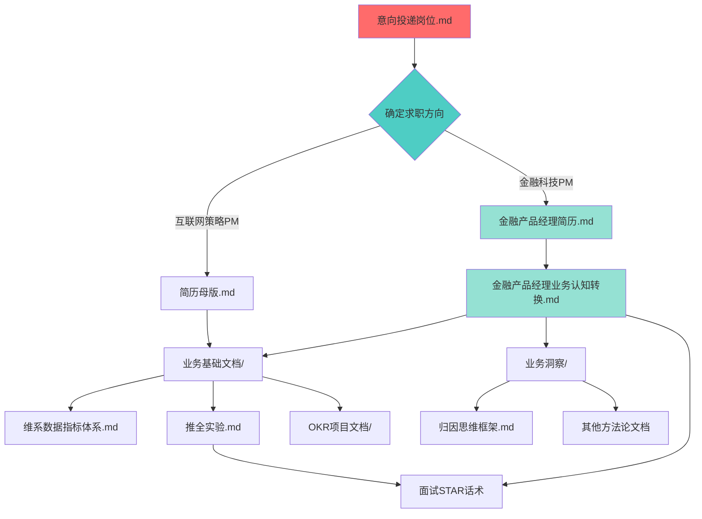

# 求职准备知识库 - 项目导航

> **项目定位**: 基于快手用户增长激励策略PM实习经历的求职材料知识库  
> **核心价值**: 将互联网实习经验迁移到多个求职方向（策略PM/金融科技PM/商业化PM）  
> **使用方式**: 根据目标岗位选择对应文件组合，生成定制化简历和面试准备材料

---

## 📊 项目概览

```
核心逻辑流:
实习经历原始材料 → 方法论提炼 → 行业语言转换 → 简历产出 → 面试话术
     ↓                  ↓              ↓            ↓           ↓
业务基础文档/      业务洞察/    业务认知转换.md   简历/   面试准备(话术在转换文档中)
```

---

## 🗂️ 目录结构与文件关系

### **根目录核心配置文件**

| 文件名 | 作用 | 依赖关系 | 使用场景 |
|:---|:---|:---|:---|
| **意向投递岗位.md** | 岗位优先级策略 | 无依赖，是起点文档 | 确定求职方向时第一个阅读 |
| **金融产品经理业务认知转换.md** | 互联网→金融语言翻译手册 | 依赖`业务基础文档/`和`业务洞察/` | 准备金融科技岗位面试时使用 |

#### 文件关系说明
```
意向投递岗位.md (确定方向)
    ↓
    ├─→ 互联网策略PM方向 → 使用 简历母版.md + 业务基础文档/
    └─→ 金融科技PM方向 → 使用 金融产品经理简历.md + 金融产品经理业务认知转换.md
```

---

### **📁 简历/ (产出物目录)**

| 文件名 | 适用方向 | 数据来源 | 特点 |
|:---|:---|:---|:---|
| **简历母版.md** | 互联网产品/运营岗 | 腾讯PCG实习+国泰君安实习 | 原始版本，不含快手实习 |
| **金融产品经理简历.md** | 金融科技/券商/基金PM | 快手实习+金融语言改造 | 将激励策略包装为风险管理与资金配置 |

#### 改造逻辑
```
简历母版.md (原始版本)
    ↓ 
    + 快手实习经历 (从业务基础文档/提取数据)
    ↓
    + 金融语言转换 (使用金融产品经理业务认知转换.md的映射表)
    ↓
金融产品经理简历.md (金融风格版本)
```

---

### **📁 快手用增激励PM/ (核心知识库)**

这是整个项目的**数据源和方法论仓库**，其他所有文件都从这里提取素材。

#### **子目录1: 业务基础文档/ (原始材料层)**

```
业务基础文档/
├── 维系数据指标体系.md           # 核心指标定义：DAU、AEPU、ROI等
├── 维系业务OKR.md                 # 业务目标框架
├── 维系业务数据概况.csv           # 基础数据表
├── 推全实验.md                    # STAR结构实验复盘（面试必备）
└── O1_承接存量用户目标,优化DAU结构与激励机制/
    ├── KR1_扩大核心用户规模/
    │   └── 激励任务中心入口优化.md
    └── KR2_降低边缘用户成本,释放维系预算/
        ├── 基于AEPU约束金币出价.md
        ├── 基于用户拉取原因的约束出价.md
        ├── 基于用户激励ROI的签到成本调优.md
        └── 提现门槛与余额回收策略整合优化.md
```

**使用逻辑**:
- **简历撰写**: 从`推全实验.md`和各KR子目录提取量化数据和项目描述
- **面试准备**: 使用`推全实验.md`的STAR结构作为话术模板
- **指标问答**: 参考`维系数据指标体系.md`准备数据分析题

#### **子目录2: 业务洞察/ (方法论层)**

```
业务洞察/
├── 归因思维框架.md              # 数据分析方法论（31KB，最大文件）
├── 漏斗数据定位归因方法论.md     # 漏斗分析工具箱
├── 维系指标体系业务洞察.md       # 指标体系深度解读
└── 高阶思维洞察.md               # 思维模型总结
```

**使用逻辑**:
- **面试准备**: 用`归因思维框架.md`准备"如何定位问题"类问题
- **能力证明**: 展示方法论沉淀能力，证明不只是执行者
- **简历补充**: 从这里提取"方法论沉淀"作为专业能力

#### **子目录3: 学习资料/ (扩展预留)**
- 目前为空，可存放行业报告、竞品分析等补充材料

---

### **📁 腾讯PCG产品策划/ (预留目录)**
- 目前为空，可能用于另一个求职方向的准备

---

## 🔗 核心文件依赖关系图



