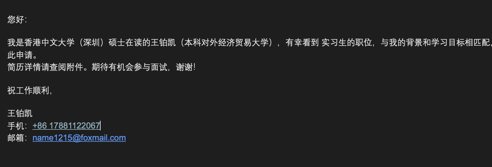

# 广告策略优化学习

## 广告出价学习
广告出价策略（Bidding Strategy）是广告主在广告竞价系统中，决定为每次广告展示/点击/转化愿意支付多少钱的规则。

### 基于CVR的人群出价
核心逻辑：高转化率人群高出价，低转化率人群低出价
能力要求：用户分层能力，从表象归纳背后作用的本质原因能力

### 基于场景的动态出价
核心逻辑：流量价值随时间/场景变化，出价也应动态调整
能力要求：场景识别，数据收集聚类能力

### 基于竞对的出价调整
核心逻辑：根据竞争对手出价，动态调整
能力要求：竞品分析，数据监测能力

### 基于转化漏斗的出价优化
核心逻辑：分析整体转化漏斗：例如展示 → 点击 → 落地页访问 → 加购 → 下单 → 支付
能力要求：纵向链路分析+横向维度拆解

### 智能出价的约束优化
核心逻辑：设定目标，维持护栏

## 广告竞价学习
广告竞价是一个拍卖系统，多个广告主竞争有限的广告位，通过出价和质量综合排序，决定谁的广告能展示以及付多少钱。

谁能展示？排序问题
广告主需要付多少钱？定价问题
平衡平台（拿到收入）、广告主（获得收益）、用户（体验）的三方利益

### 竞价的步骤
步骤1：用户触发广告请求
  用户刷信息流 → 系统检测到广告位 → 发起广告召回

步骤2：广告召回
  从广告库中筛选候选广告（例如：1000个广告候选）
  筛选条件：定向（地域/性别/兴趣）、预算是否充足

步骤3：竞价排序（核心）
  计算每个广告的eCPM：
  eCPM = 出价 × 预估CTR × 1000 × 质量分
  
  按eCPM降序排列：
  广告A：eCPM = 500
  广告B：eCPM = 450
  广告C：eCPM = 400
  ...
  
步骤4：确定展示与扣费
  展示：eCPM最高的广告A胜出
  扣费：按第二价格机制（后面详解）

步骤5：用户看到广告
  广告A展示给用户
  用户可能点击/忽略/反感

步骤6：效果反馈
  如果用户点击 → 广告主付费 → 平台收入
  如果用户忽略 → 不付费（CPC模式）
  数据反馈到算法 → 更新预估CTR

### 竞价排序的核心公式
eCPM = 出价 × 预估CTR × 1000 × 质量分
其中：
- 出价：广告主愿意为每次点击支付的金额（可分为广告主控制以及平台智能自动出价）
- 预估CTR：算法预测用户点击这个广告的概率（平台算法控制）
- 质量分：广告质量评分（素材质量、用户反馈、转化率等）
- 1000：转换为千次展示收益（CPM的M是Mille，拉丁文的千）

### 主流竞价机制
- 第一价格拍卖：出价最高者胜出，并且按自己的出价付费
❌ 赢家诅咒：广告主害怕出价太高，会故意压低出价
❌ 不稳定：广告主会不断试探底价，市场波动大
❌ 不透明：广告主不知道该出多少

- 第二价格拍卖：出价最高者胜出，但是只需支付第二名的出价
⚠️ 简单版不适合广告（因为有CTR差异）
⚠️ 需要改进→ GSP机制

- GSP机制（广义第二价格拍卖）：按ecpm排序，但是扣费是按第二名的ecpm
实际扣费（CPC）= 下一名的eCPM / 自己的预估CTR / 1000
实际CPC = 下一名的出价 × 下一名的CTR / 自己的CTR + 0.01元

✅ 激励优化CTR（CTR高可以少付钱）
✅ 鼓励广告质量提升
✅ 平台、广告主、用户三赢

### 关键概念指标

#### 预测CTR
预测方法：机器学习模型：
输入特征：
  - 用户特征：年龄、性别、地域、兴趣标签、历史行为
  - 广告特征：品类、素材、出价、历史CTR
  - 上下文特征：时间、位置、设备类型

模型：
  - 早期：逻辑回归
  - 现在：深度学习（Wide&Deep、DeepFM、DIN）

输出：
  - 预估CTR = 3.5%

#### 质量分
1. 用户反馈（40%）
   - 点击率CTR（历史表现）
   - 转化率CVR
   - 负反馈率（点"不感兴趣"）

2. 广告相关性（30%）
   - 广告文案与用户兴趣的匹配度
   - 落地页质量

3. 素材质量（30%）
   - 图片/视频清晰度
   - 创意吸引力

#### 底价
平台设定的最低eCPM，低于底价不展示

### 竞价的博弈策略

#### 广告主的博弈策略

1. 优化点击率获得价格优势
GSP机制下：
实际CPC = 下一名eCPM / 自己CTR 如果提高CTR → 实际CPC降低

示例：
原本：CTR 2%，下一名eCPM 200 → 实际CPC = 200/0.02/1000 = 10元
优化后：CTR 4%，下一名eCPM 200 → 实际CPC = 200/0.04/1000 = 5元

2. 出价试探
逐步降低出价试探底价

3. 分时段出价
高价值时间段提高出价，低价值时间段降低出价

#### 平台的博弈策略

1. 动态底价平台根据市场情况动态调整底价，防止广告主恶意压价或抬价

2. 质量分调控
通过调整质量分来影响广告主的eCPM，从而影响竞价结果

3. 机制创新
从GSP → 智能出价（oCPC）
让算法自动优化，提高广告主满意度
